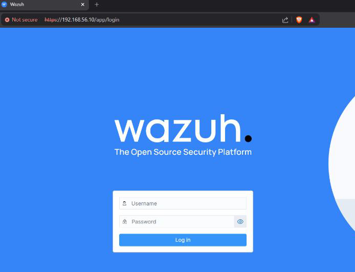
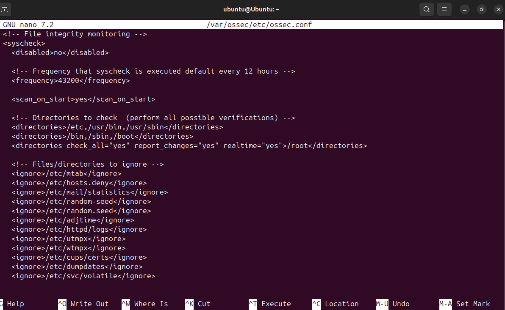
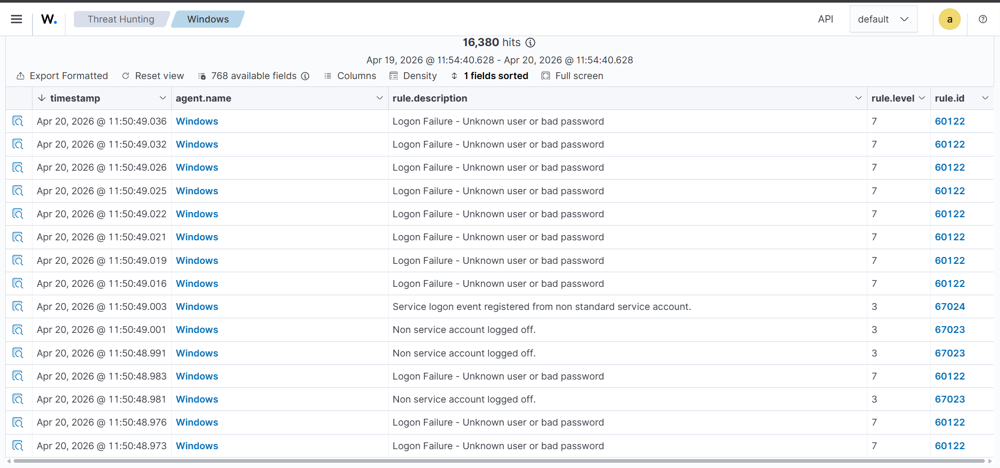
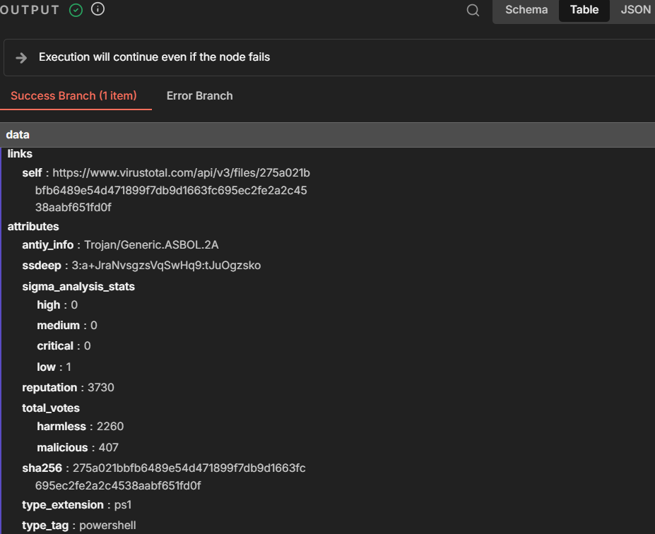
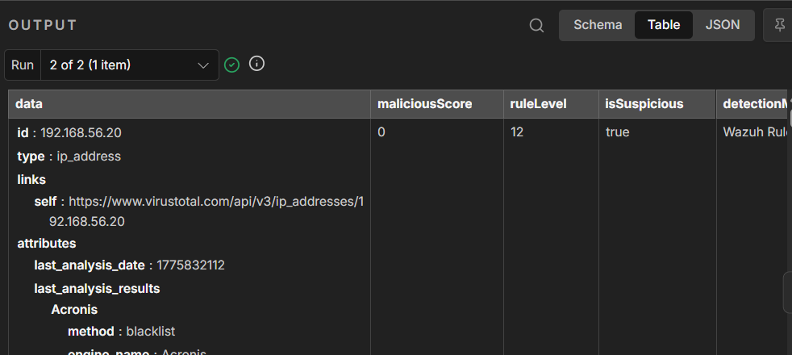

# Automated SIEM Alert Enrichment — Wazuh + n8n + VirusTotal

Automated pipeline that enriches Wazuh SIEM alerts in real time using n8n workflow automation and the VirusTotal threat intelligence API — reducing manual triage effort by automatically flagging genuinely suspicious activity based on combined rule severity and threat intelligence scoring.

  

---

## Overview

Security Operations Centers (SOCs) are often flooded with alerts, many of which are low-value or false positives. Analysts spend significant time manually cross-referencing IPs and file hashes against threat intelligence sources before deciding whether an alert deserves attention.

This project builds an **automated alert enrichment pipeline** that:
1. Captures alerts generated by Wazuh (an open-source SIEM/XDR platform)
2. Forwards them to an n8n automation workflow
3. Extracts indicators of compromise (IOCs) — IP addresses and file hashes — from the alert
4. Queries the VirusTotal API to check those IOCs against global threat intelligence
5. Computes a combined suspicion score using both the VirusTotal verdict and the Wazuh rule severity

The result: alerts are automatically enriched with threat context, and a suspicion flag helps prioritize what actually needs analyst attention — instead of a wall of undifferentiated log noise.

---

## Architecture

```
┌─────────────┐     ┌──────────────┐     ┌─────────────────┐     ┌──────────────┐
│   Kali VM   │────▶│ Wazuh Agents │────▶│  Wazuh Manager   │────▶│  n8n Webhook │
│ (attacker)  │     │ (Win/Ubuntu) │     │  (alerts.json)   │     │              │
└─────────────┘     └──────────────┘     └─────────────────┘     └──────┬───────┘
                                                                          │
                                                                          ▼
                                                                 ┌─────────────────┐
                                                                 │  Extract IOC    │
                                                                 │  (JS function)  │
                                                                 └────────┬────────┘
                                                                          │
                                                       ┌──────────────────┴──────────────────┐
                                                       ▼                                     ▼
                                              ┌─────────────────┐                 ┌─────────────────┐
                                              │ VirusTotal Hash  │                │ VirusTotal IP    │
                                              │ Lookup           │                │ Lookup           │
                                              └────────┬─────────┘                └────────┬─────────┘
                                                       └──────────────────┬──────────────────┘
                                                                          ▼
                                                                 ┌─────────────────┐
                                                                 │   Get Score     │
                                                                 │ (suspicion calc)│
                                                                 └─────────────────┘
```

**Lab environment:** 4 virtual machines on Oracle VirtualBox, communicating over a host-only network (`192.168.56.0/24`):
- Wazuh Manager (Ubuntu 22.04)
- Wazuh Agent (Ubuntu)
- Wazuh Agent (Windows 10)
- Kali Linux (attacker machine, for simulated attacks)

---

## How it works

### 1. Alert generation (Wazuh)
- Wazuh Manager and Agents deployed across Ubuntu and Windows VMs
- File Integrity Monitoring (FIM) enabled with real-time detection on both agents (`/root` on Ubuntu, `C:\test-fim` on Windows)
- `logall` and `logall_json` enabled on the Manager so all alerts are written to the JSON alert log — required for the integration script to consume them

### 2. Alert forwarding (Wazuh → n8n)
A custom Wazuh integration script (`wazuh-integration/custom-n8n.sh`) is registered in `ossec.conf` and triggered automatically for any alert at or above rule level 7. It forwards the alert JSON via `curl` to the n8n production webhook.

### 3. IOC extraction (n8n)
The `Extract IOC` function node parses the incoming Wazuh alert and extracts:
- Source IP address
- File hash (SHA256, from syscheck or alert data)
- Rule description, rule ID, rule level
- Agent name and timestamp

It also sets `hasHash` / `hasIp` boolean flags used for conditional routing to the correct VirusTotal lookup.

### 4. Threat intelligence enrichment (VirusTotal)
Two HTTP Request nodes query the VirusTotal REST API:
- `/api/v3/files/{hash}` — file hash reputation lookup
- `/api/v3/ip_addresses/{ip}` — IP reputation lookup

### 5. Suspicion scoring (n8n)
The `Get Score` function node combines:
- VirusTotal's `malicious` detection count (from `last_analysis_stats`)
- Wazuh's native rule severity level

An alert is flagged `isSuspicious: true` if **either** the VirusTotal malicious score is greater than zero **or** the Wazuh rule level is 10+ — ensuring high-severity Wazuh alerts are still flagged even if the IOC isn't yet indexed in VirusTotal's database.

---

## Testing & validation

The pipeline was validated using controlled attack simulations:

| Test | Method | Result |
|---|---|---|
| SSH brute-force detection | Hydra + rockyou.txt wordlist against agent SSH service | Triggered Wazuh rule `60122` (Logon Failure) at rule level 7 — visible in Threat Hunting dashboard, 16,000+ hits captured |
| File Integrity Monitoring | Created/deleted test file in monitored directory | Triggered rule `554` (file added) and rule `553` (file deleted) |
| VirusTotal hash enrichment | Queried known-malicious test hash | Returned `Trojan/Generic.ASBOL.2A` classification with 407 malicious votes |
| End-to-end suspicion scoring | Full pipeline run | `isSuspicious: true` correctly computed from combined VirusTotal + rule level data |

---

## Screenshots

| | |
|---|---|
|  *Wazuh Dashboard login* |  *File Integrity Monitoring configuration* |
|  *SSH brute-force alerts in Threat Hunting view* |  *VirusTotal hash reputation lookup* |
|  *n8n suspicion scoring output* | |

---

## Repository structure

```
wazuh-alert-enrichment/
├── README.md
├── n8n-workflow/
│   └── Wazuh_Alert_Enrichment_Workflow.json
├── wazuh-integration/
│   ├── custom-n8n.sh
│   ├── ossec-integration-block.xml
│   ├── ubuntu-agent-fim-config.xml
│   └── windows-agent-fim-config.xml
└── screenshots/
    ├── wazuh-dashboard.png
    ├── ssh-bruteforce-threat-hunting.png
    ├── virustotal-hash-lookup.png
    ├── n8n-get-score-node.png
    └── fim-configuration.png
```

---

## Tech stack

- **SIEM:** Wazuh (Manager + Agents)
- **Automation:** n8n (self-hosted workflow automation)
- **Threat Intelligence:** VirusTotal API v3
- **Virtualization:** Oracle VirtualBox
- **Operating Systems:** Ubuntu 22.04/24.04, Windows 10, Kali Linux
- **Scripting:** Bash, JavaScript (n8n function nodes)
- **Attack simulation:** Hydra (SSH brute-force)

---

## Setup notes

> This repo documents a lab/proof-of-concept build. To reproduce:
1. Deploy Wazuh Manager + Agents (Ubuntu/Windows) in a virtualized network
2. Enable `logall` / `logall_json` on the Manager
3. Configure FIM (`syscheck`) on agents per `wazuh-integration/*-fim-config.xml`
4. Add the `custom-n8n` integration block to the Manager's `ossec.conf`
5. Place `custom-n8n.sh` at `/var/ossec/integrations/custom-n8n` and make it executable (`chmod +x`)
6. Import `n8n-workflow/Wazuh_Alert_Enrichment_Workflow.json` into your n8n instance
7. Replace `YOUR_VIRUSTOTAL_API_KEY` in the workflow with your own VirusTotal API key (get one free at [virustotal.com](https://www.virustotal.com))
8. Activate the webhook and trigger a test alert

---

## Author

**Ranjit Ramja**
[LinkedIn](https://www.linkedin.com/in/ranjit-ramja-37951a353/) · [TryHackMe](https://tryhackme.com/p/Ranjit07)
